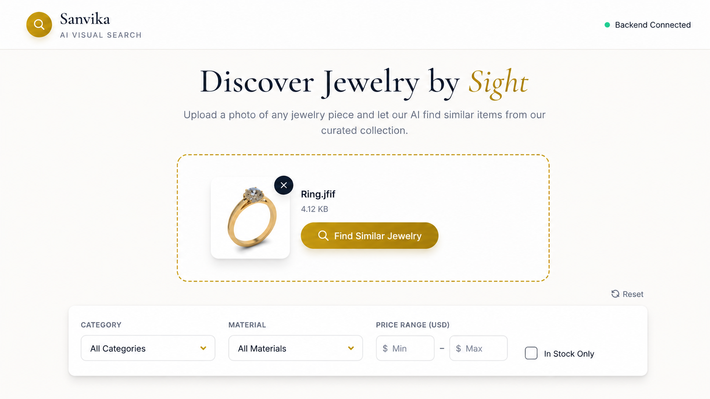
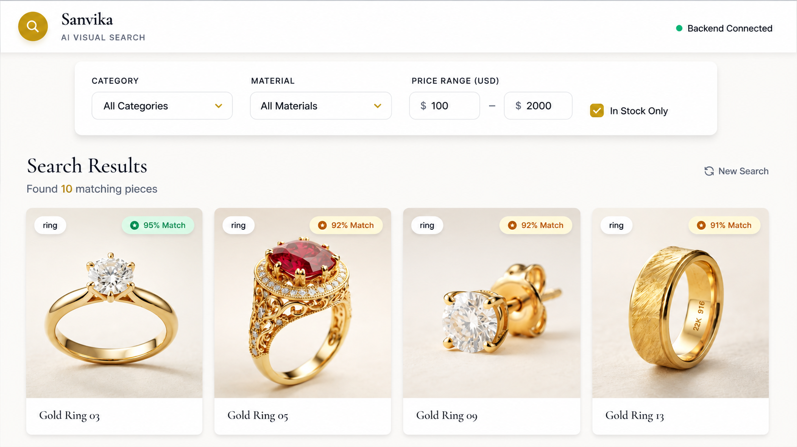

# Sanvika AI — Visual Jewelry Search Engine

A production-ready, AI-powered visual search engine designed for jewelry e-commerce. This application allows users to upload an image of a jewelry piece and instantly discover visually similar items from a catalog using deep learning embeddings and vector search.

## Key Features

- **Reverse Image Search:** Powered by OpenAI's CLIP model (clip-vit-base-patch32) to generate 512-dimensional image embeddings.
- **Vector Database:** Utilizes MongoDB Atlas Vector Search (Hierarchical Navigable Small World algorithm) for sub-100ms Approximate Nearest Neighbor (ANN) retrieval.
- **Dynamic Pre-Filtering:** Seamlessly combines vector similarity with hard database filters (price range, material, category, in-stock status) at the database level for perfect recall.
- **Modern Architecture:** Fully asynchronous backend built with FastAPI and the Motor MongoDB driver.
- **Containerized:** Dockerized deployment environment with persistent volume caching for heavy ML models.
- **Responsive UI:** Glassmorphic, modern frontend built with Tailwind CSS and Vanilla JavaScript.

## Tech Stack

- **Backend:** Python 3.10+, FastAPI, Uvicorn, Pytest
- **AI / ML:** Hugging Face transformers, PyTorch (CPU-optimized for inference)
- **Database:** MongoDB Atlas, Motor (Async Python Driver)
- **Infrastructure:** Docker, Docker Compose
- **Frontend:** HTML5, JavaScript, Tailwind CSS

## UI Preview

### Upload Interface


### Search Results & Matching


## Prerequisites

Before running the application, ensure you have the following installed:

- Docker & Docker Compose
- Python 3.10+ (For local testing and ingestion scripts)
- A MongoDB Atlas cluster (M0 free tier is sufficient)

## Quick Start

### 1. Environment Setup

Create a `.env` file in the root directory and configure your MongoDB Atlas connection string and database details:

```env
MONGODB_URI="mongodb+srv://<username>:<password>@<cluster>.mongodb.net/?retryWrites=true&w=majority"
MONGODB_DB_NAME="jewelry_inventory"
MONGODB_COLLECTION_NAME="products"
VECTOR_INDEX_NAME="jewelry_vector_index"
```

### 2. Build and Run the Container

Start the FastAPI backend and initialize the ML model cache using Docker:

```bash
docker-compose up -d --build
```

The API will be available at `http://localhost:8000`. You can view the interactive Swagger documentation at `http://localhost:8000/docs`.

### 3. Launch the UI

The frontend requires no build steps. Simply open `frontend/index.html` in any modern web browser to interact with the search engine.

## Database Configuration

For the visual search to function, you must configure an Atlas Vector Search Index on your MongoDB collection.

Run the setup script to generate the exact JSON configuration required for the Atlas UI:

```bash
python scripts/setup_atlas_index.py --uri <YOUR_MONGODB_URI>
```

Paste the generated JSON into the MongoDB Atlas Search configuration panel under the index name `jewelry_vector_index`.

## API Reference

| Method | Endpoint | Description |
|---|---|---|
| GET | `/health` | Application health and DB connection status |
| POST | `/v1/embeddings/generate` | Generates a 512-dim CLIP embedding from an uploaded image |
| POST | `/v1/search/visual` | Executes vector search pipeline with dynamic multipart/form-data filters |

## Testing

The project includes a robust test suite covering API endpoints, model instantiation, error handling, and integration flows.

To run the test suite locally:

```bash
# Install testing dependencies
pip install pytest pytest-asyncio httpx

# Execute tests
pytest tests/ -v
```